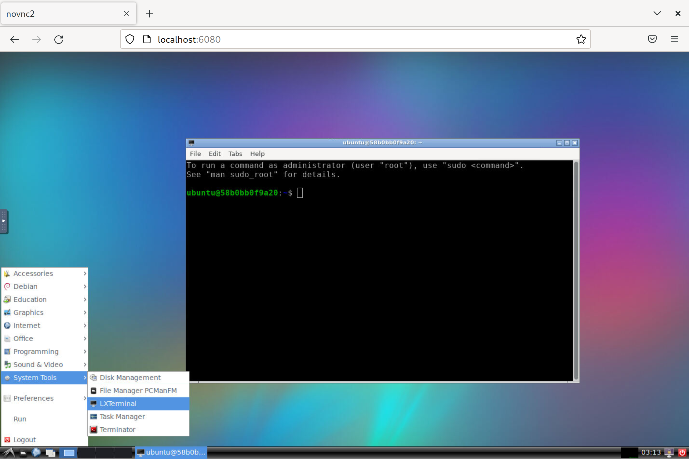
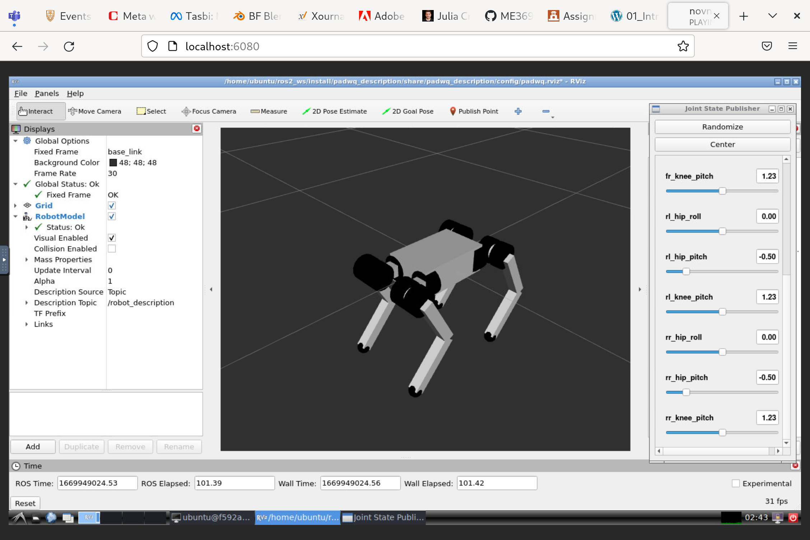
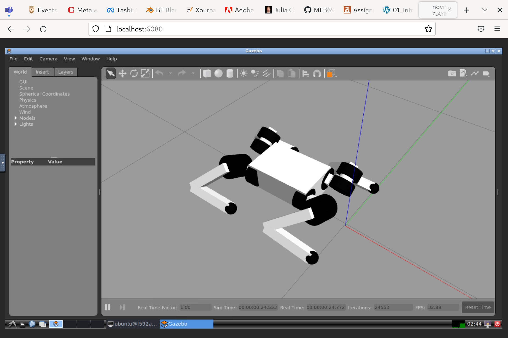

# me396p_project
The goal of our course project was to implement the ROS2 package which will allow us to simulate and control the [PADWQ](10.1109/UR52253.2021.9494653) robot.

## Setup
The members of our team all use different operating systems, so instead of creating a virtual machine we decided to use the Docker container instead, which could be launched on most of modern operating systems with the Docker installed. The following section describes how to deploy this container and run our package. If you already have the machine with ROS2  Humble installed you are free to just enter the ``ros2_ws`` folder and go directly to the [next section](#launch-a-package).

First, you need to install Docker engine to your system. Proceed to the [official webite](https://docs.docker.com/get-docker/) in order to get the platrofm specific instructions.

### Run a container

Second, you need to deploy your container. We have prepared bash script which do all the things and launching it for you. If you are using Ubuntu, you can simply run the container with the following command:

```bash
./container/run.sh
```

The image of the container will be build during the first launch, so it will take more time to start up (and about 6Gb of your disk space). After the launch process is completed, you will be provided with a command line interface. Graphical applications that you run will be displayed natively in your operating system. This approach was tested on Ubuntu 20.04 and 22.04, but should work on most of modern Linux systems. Strictly speaking this approach should work on any Linux operating system which uses X11 display server or Wayland with XWayland support.

If you are using Windows, Mac or Linux system on pure Wayland, you can run container with a VNC interface and interact with it using your internet browser. If you are using Linux or Mac just open the terminal right away. If you are using Windows you have to install WSL first and make sure that the ``docker`` executable is visible inside of Linux subsystem. Check[this](https://learn.microsoft.com/en-us/windows/wsl/tutorials/gui-apps) and [this](https://docs.docker.com/desktop/windows/wsl/) links to get more detailed instructions. Open your terminal and run the following command:

```bash
./container/run.sh vnc
```

Then navigate to

```
localhost:6080
```

in any browser window. You will see a desktop environment launched inside of a Docker container. Open the terminal application there and you are ready to go.



## Launch a package
Navigate to ROS workspace

```bash
cd ./ros2_ws
```
and build the PADWQ package

```bash
colcon build
```

Then, source the package you have build

```bash
source install/setup.bash
```

and run it

```bash
ros2 launch padwq padwq.launch.py
```




