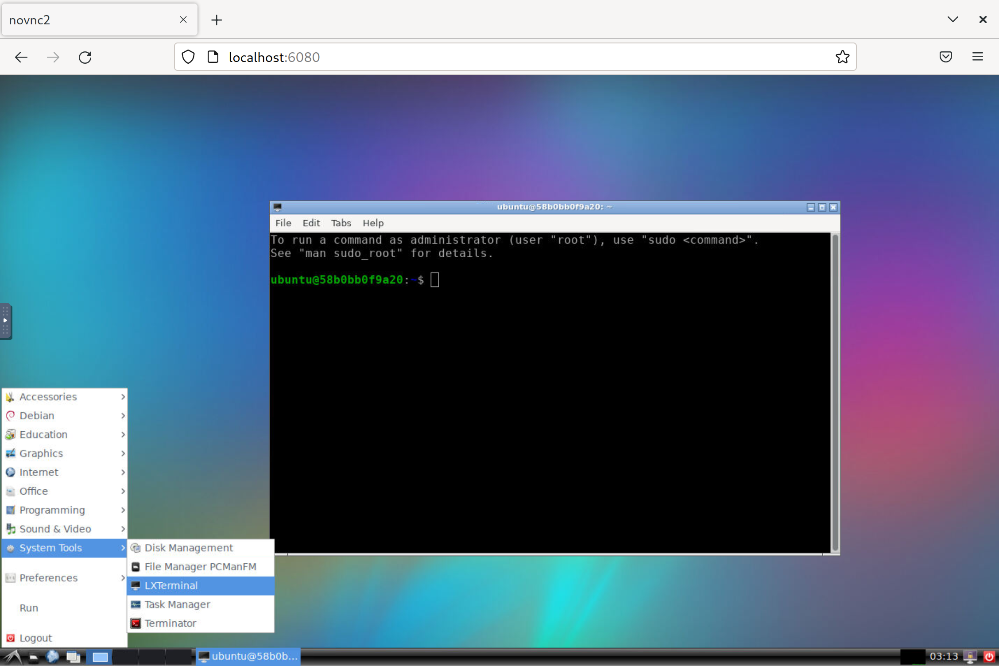
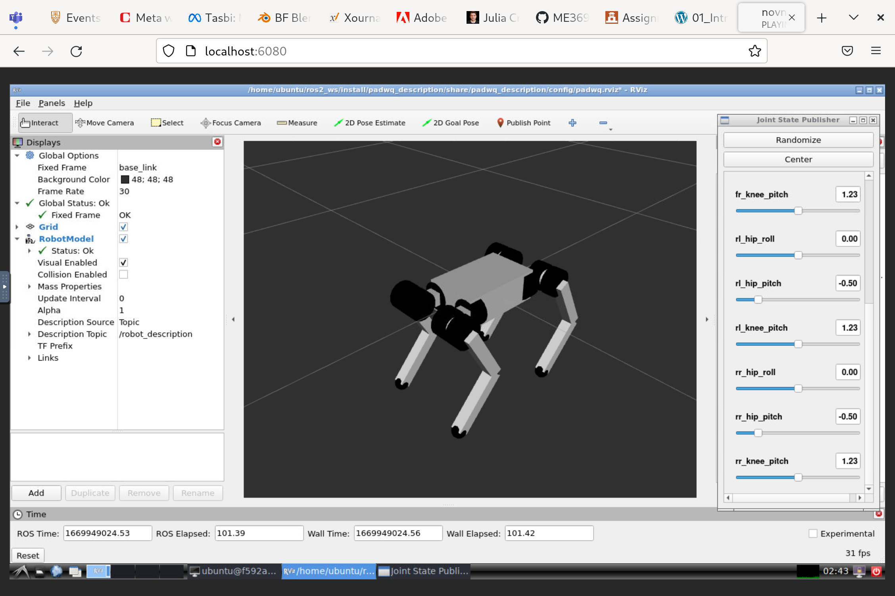
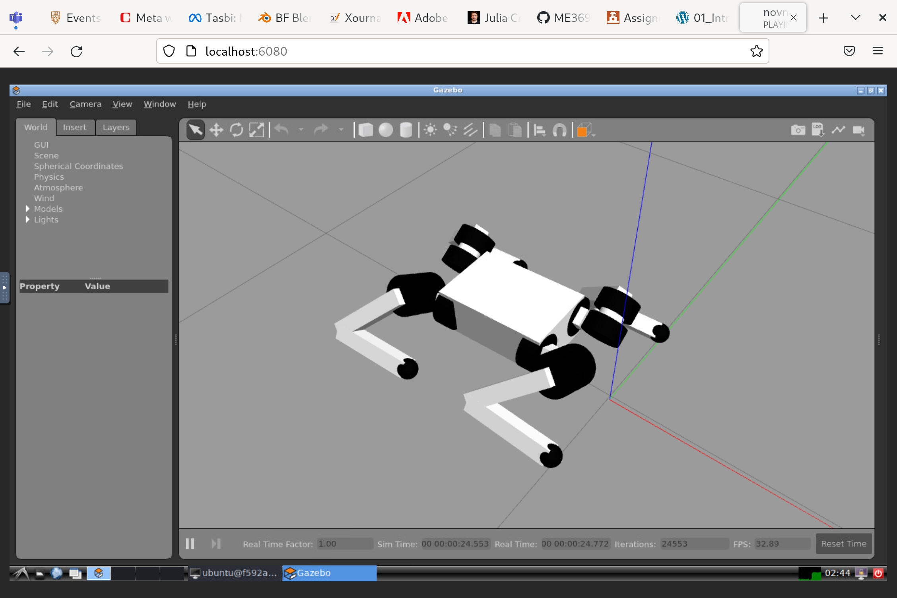
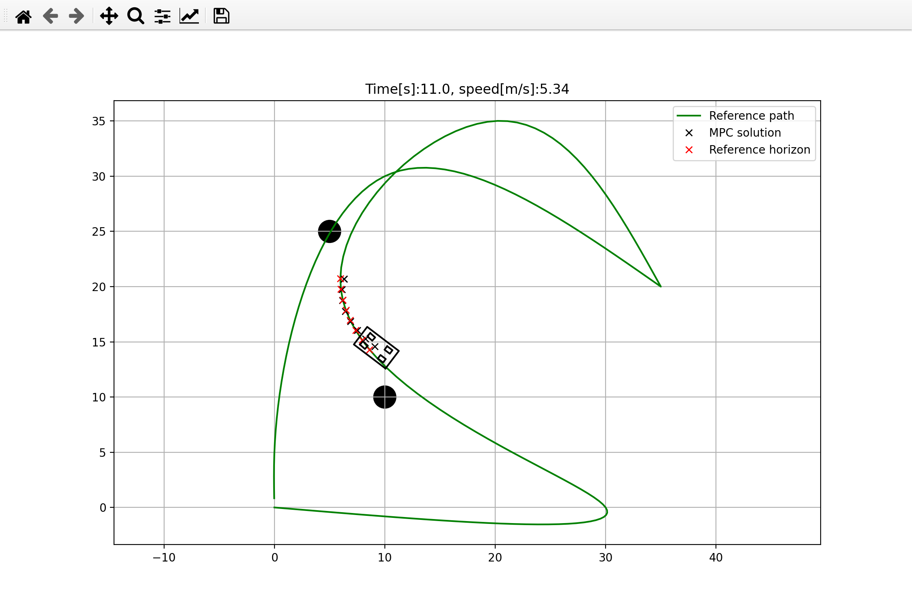

# me396p_project
The goal of our course project was to implement the ROS2 package which will allow us to simulate and control the [PADWQ](https://ieeexplore.ieee.org/document/9494653) robot.

## Setup
The members of our team all use different operating systems, so instead of creating virtual machines we decided to use the Docker container instead, which could be launched on most of modern operating systems with the Docker installed. The following section describes how to deploy this container and run our package. If you already have the machine with ROS2  Humble installed you are free to just enter the ``ros2_ws`` folder and go directly to the [next section](#launch-a-package).

First, you need to install Docker engine to your system. Proceed to the [official webite](https://docs.docker.com/get-docker/) in order to get the platform specific instructions.

### Deploy the container

Second, you need to deploy our container. We have prepared a Bash script which does all the things and launches it for you. If you use Ubuntu, you can simply run the container with the following command:

```bash
./container/run.sh
```

The image of the container will be built during the first launch, so it will take more time to start up (and about 6Gb of your disk space). After the launch process is completed, you will be provided with a command line interface. Graphical applications that you run will be displayed natively in your operating system. This approach was tested on Ubuntu 20.04 and 22.04, but should also work on most of modern Linux systems. Strictly speaking, this approach should work on any Linux operating system which uses X11 display server or Wayland with XWayland support.

If you use Windows, Mac or Linux system on pure Wayland, you can run the container with a VNC interface and interact with it using your Internet browser. If you use Linux or Mac, just open the terminal right away. If you use Windows, you have to install WSL first and make sure that the ``docker`` executable is visible inside of the Linux subsystem. Check [this](https://learn.microsoft.com/en-us/windows/wsl/tutorials/gui-apps) and [this](https://docs.docker.com/desktop/windows/wsl/) links to get more detailed instructions. Open your terminal and run the following command:

```bash
./container/run.sh vnc
```

Then navigate to

```
localhost:6080
```

in any browser window. You will see a desktop environment launched inside of the container. Open the terminal application there and you are ready to go.



## Launch a package
Navigate to ROS workspace

```bash
cd ./ros2_ws
```
and build the PADWQ package with

```bash
colcon build
```

Then, source the package you have built

```bash
source install/setup.bash
```

We have two packages in our repo. First, we have ``padwq_description`` which contains the URDF model of the robot and couple of launch files. You can run the Rviz2 in order to look at the robot and manually move any of its joints:

```bash
ros2 launch padwq_description rviz.launch.py
```



You also can spawn the robot to the Gazebo without any control input:

```bash
ros2 launch padwq_description gazebo.launch.py
```



Second, we have the ``padwq_bringup`` package which contains the robot controllers configs and the controllers itself. Unfotrunately, our robot controllers are **not working right now** and we have not implemented the MPC control for the PADWQ robot so far. For now we have added a very simple script which sends initial state constants to the ros2 controllers, but our robot is not stable and wobbling a lot for the unknown reason. If you read this line, we are probably trying to find an error at this very moment. Anyway, you can spawn the robot to the Gazebo with that simple controller and look at its crazy moves:

```bash
ros2 launch padwq_bringup gazebo.launch.py
```


## Simple MPC demo
While learning the concept of the MPC control, we created a simple demo where we are controlling [bicycle model](https://sumemura.jp/simplified-steady-state-vehicle-handling-model/) - simplified model of the vehicle. We used its steering angle and forward velocity in order to control one using MPC. You can go to the folder ``mpc_demo`` and run it from the Docker container with the following command:

```bash
python main.py
```

It will construct the optimization problem with a CasADi package and create the window with the model itself, obstacles, a reference and an actual path. Hit the ``Enter`` button in the terminal where you have launched the python script in order to start the simulation.


